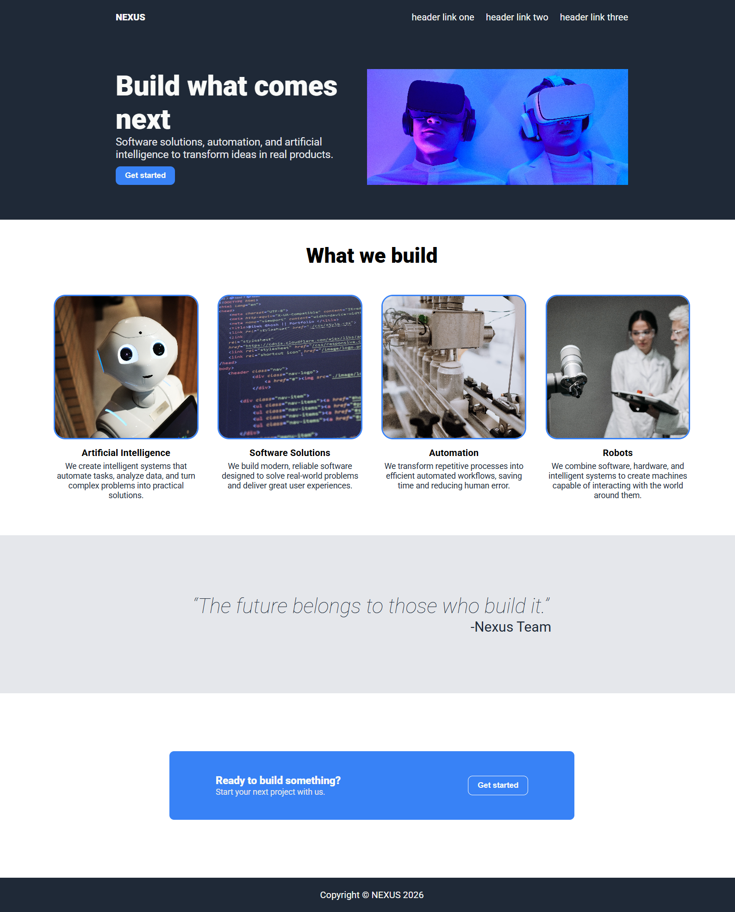

# NEXUS - Landing Page
A landing page project built as part of The Odin Project curriculum to practice HTML, CSS, and Flexbox.

## Technologies
- HTML5
- CSS3
- CSS Flexbox
- Google Fonts (Roboto)
## Preview

[Live Demo](https://arthurfonsecadocarmo.github.io/Landing-Page-Theodinproject/)
## What I learned
- Flexbox
- box-sizing
- Semantic HTMl Structure
- Styling images, buttons, and links
- Using external fonts
- Margin and padding
- Alignment and element distribution
## How to run
Clone the repository:
   ```bash
   1. git clone https://github.com/arthurfonsecadocarmo/Landing-Page-Theodinproject.git
2. Open index.html in your browser.